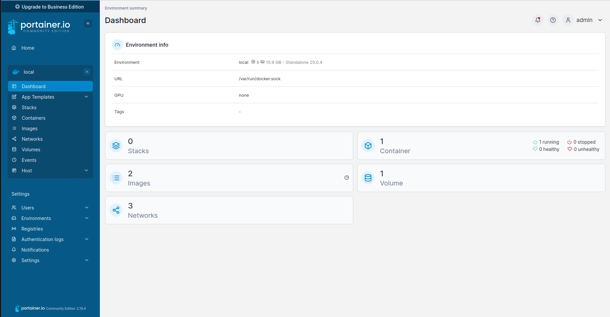

# Deploying Containers

I use portainer to help me deploy and manage docker containers. Docker containers are a form of computer [virtualization](https://aws.amazon.com/what-is/virtualization/) that help developrs create and deploy software. The most enticing feature about containers is their ability to create **reporduceable enviroments**, efforlessly managing [software dependencies](https://phoenixnap.com/blog/software-dependencies). 

