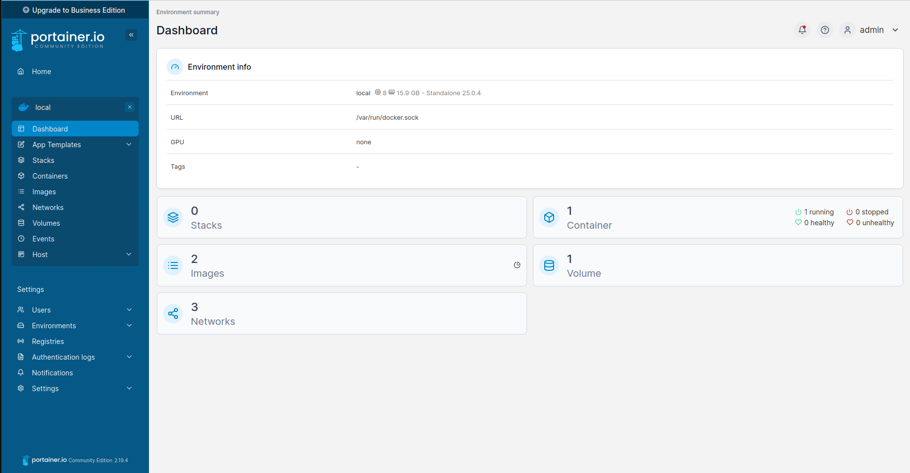
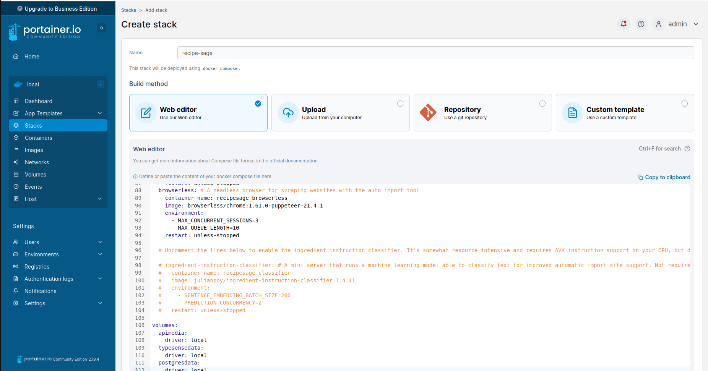
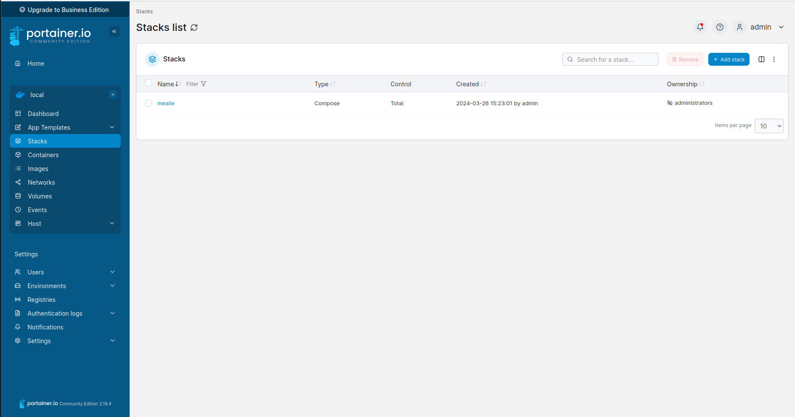
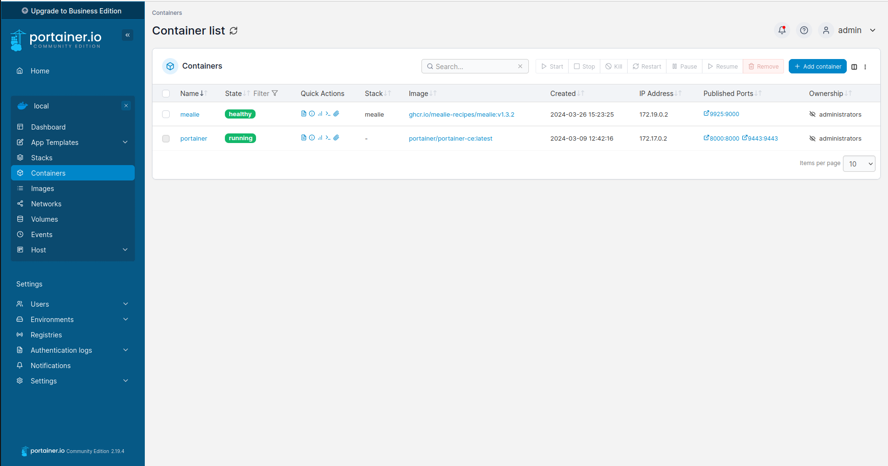
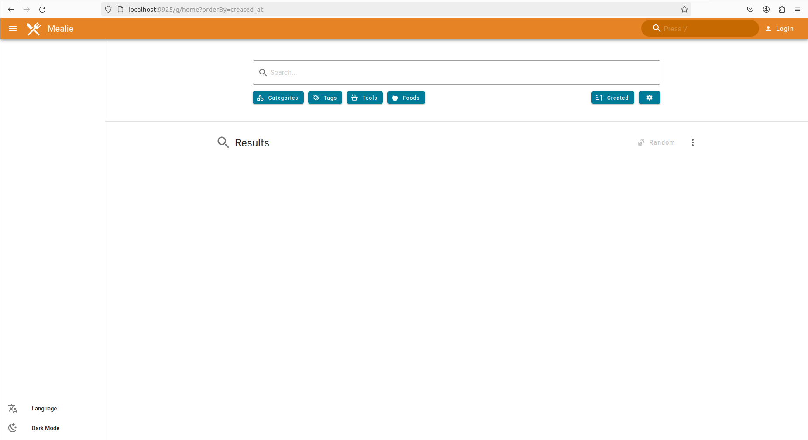

# Deploying Containers

I use portainer to help me deploy and manage docker containers. Docker containers are a form of computer [virtualization](https://aws.amazon.com/what-is/virtualization/) that help developers create and deploy software. The most enticing feature about containers is their ability to create **reproducible environments**, effortlessly managing [software dependencies](https://phoenixnap.com/blog/software-dependencies).

Working with containers usually involves using the linux command line and can sometimes be a tedious process. While in the command line the user needs to know every command for all of the actions that they want to perform. Portainer demonstrates an application of **Visibility of System Status** , a [useability guideline](https://www.nngroup.com/articles/ten-usability-heuristics/) that help users understand what is happening by making the system status **visible**. Here is a screenshot from the instance of portainer that is running on my laptop.

Whenever I want to deploy a new container I click on the selection on the side menu labeled stacks. Here I can specify a [docker-compose](https://docs.docker.com/compose/compose-application-model/) file using [YAML](https://en.wikipedia.org/wiki/YAML).

Once I create my configuration I just have to click on the deploy button on the bottom of the page and portainer saves my new stack as a template as well as also deploying all of the containers that I specified.

To verify that my container was deployed, click on the containers selection on the side menu. Here I can see that my stack deployed and my container is currently running and healthy. This is a more usable system than the command line for me because I do not have to remember any commands in order to check on the status of my containers.

As you can see my application deployed successfully.

